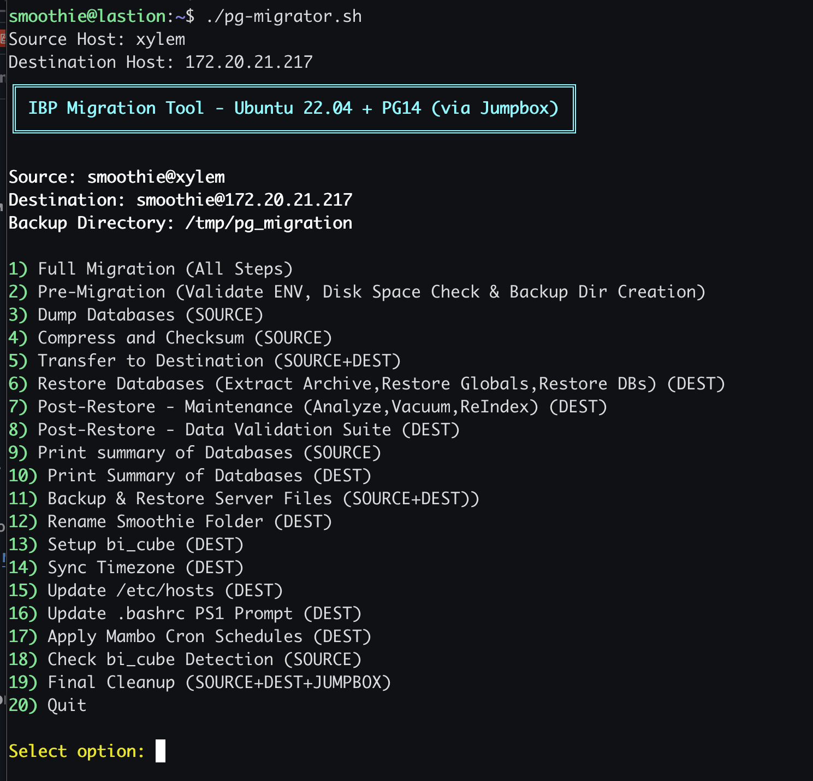
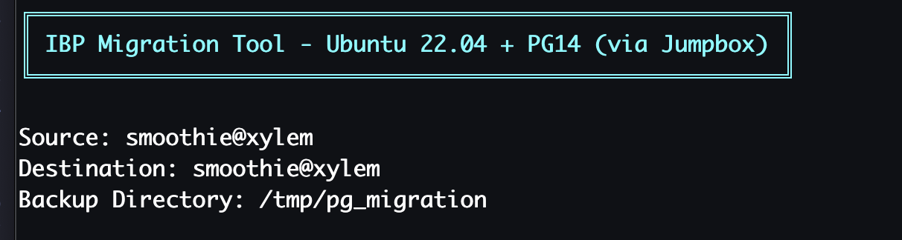
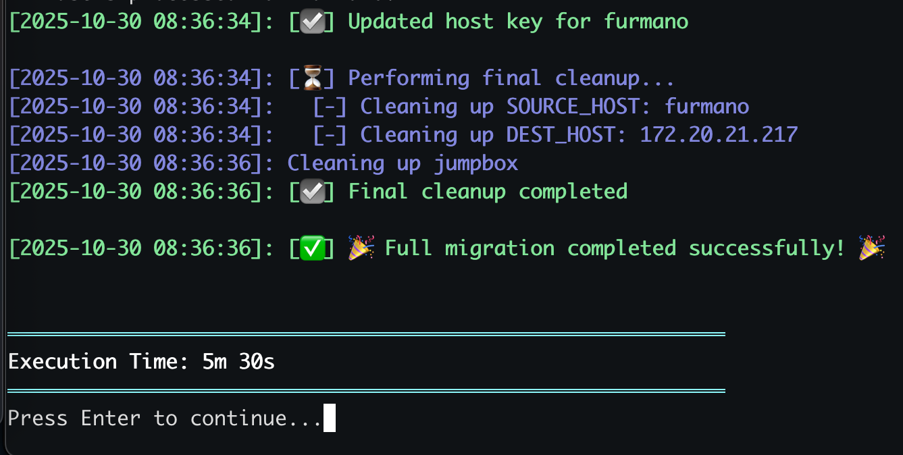
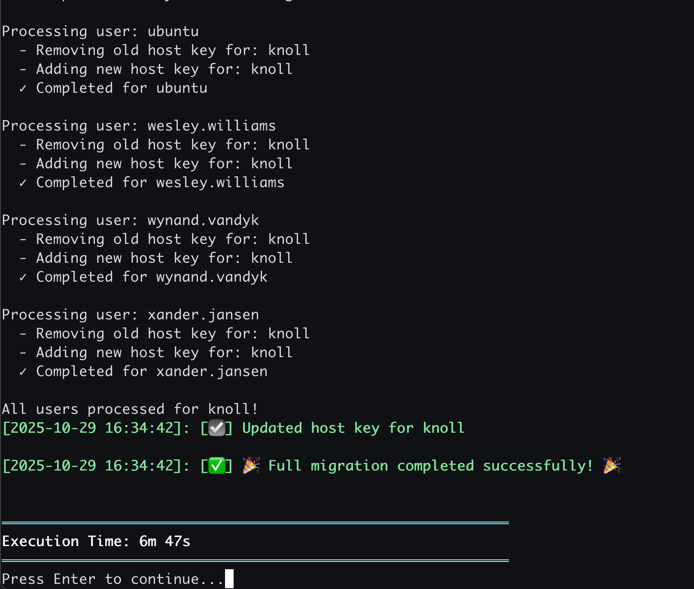
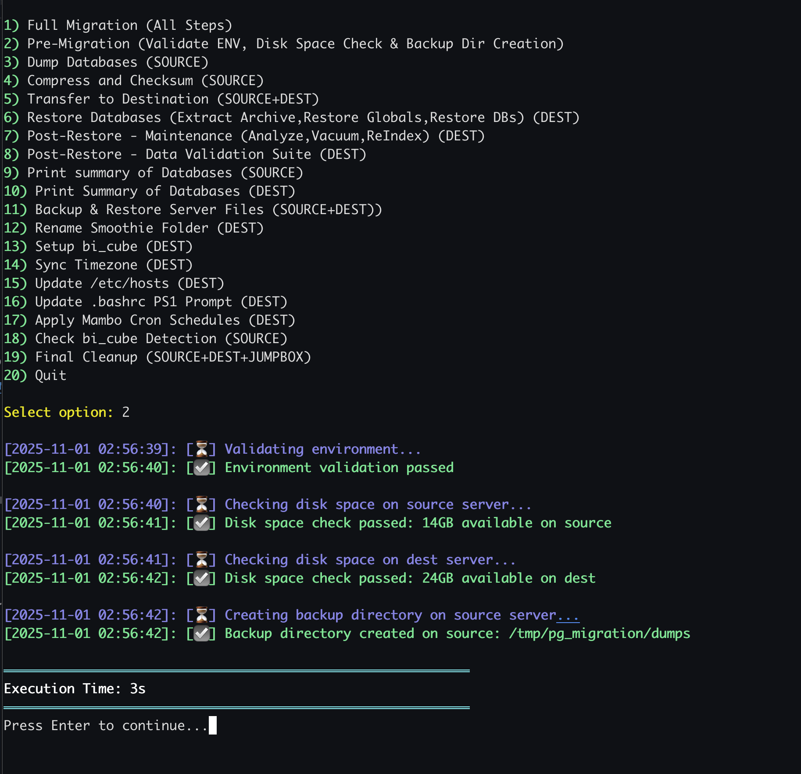
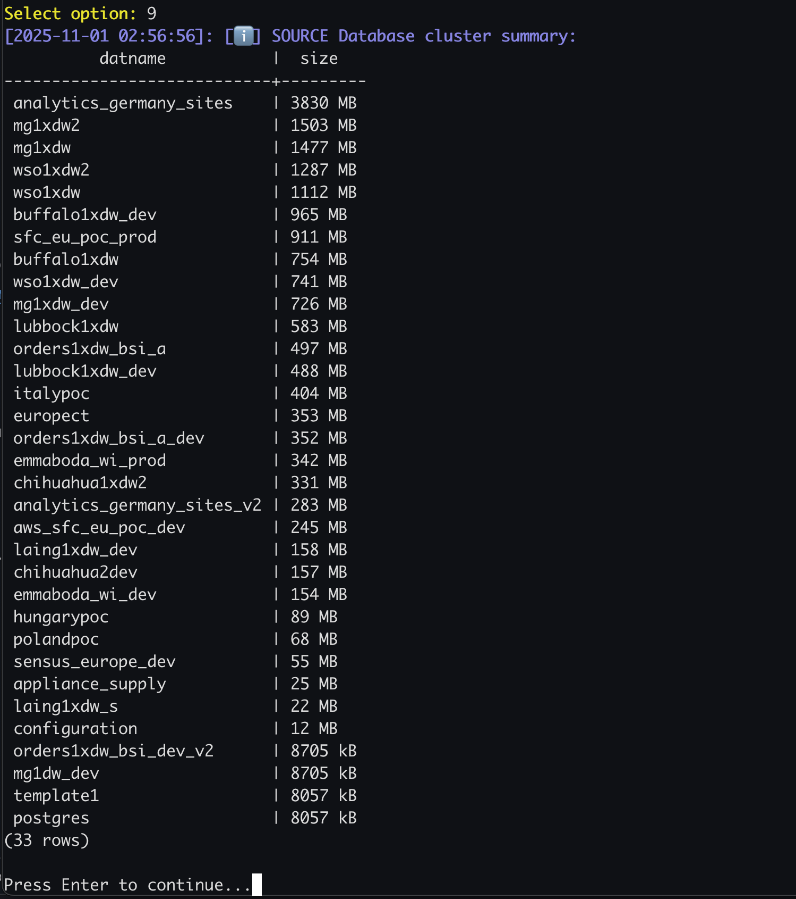
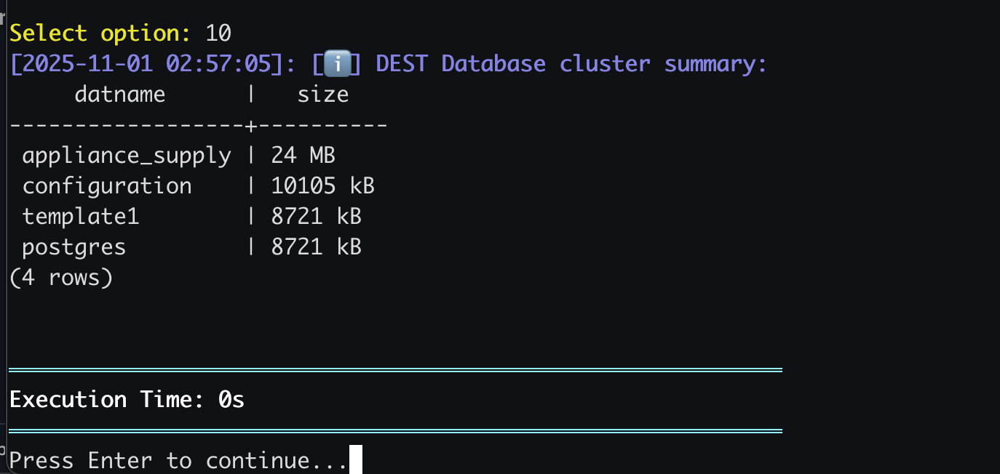
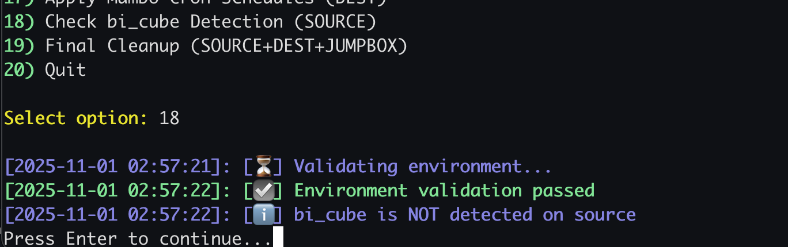
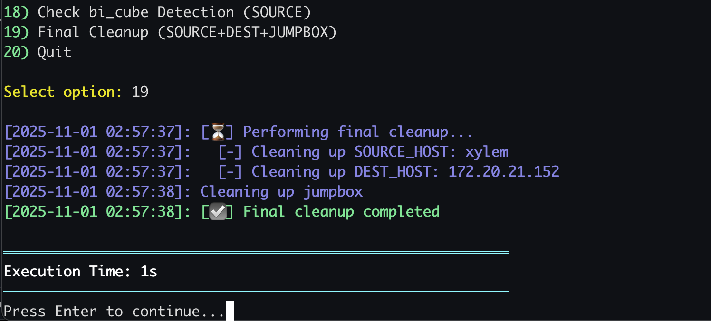

# PostgreSQL Migration Tool - User Guide

## Overview

The **IBP Migration Tool** (`pg-migrator.sh`) is a comprehensive bash script designed to migrate IBP EC2 instances from older Ubuntu versions with PostgreSQL 12 to Ubuntu 22.04 with PostgreSQL 14. The tool executes from a jumpbox server with SSH access to both source and destination servers.

## Purpose

This tool automates the complete migration process including:
- PostgreSQL database dumps and restores with parallel processing
- Server configuration file transfers (jetty, SSH keys, salt minion, scripts)
- Optional bi_cube environment setup
- System configuration synchronization (timezone, hostname, cron schedules)
- Data validation and integrity checks

## Architecture

```
┌──────────┐         ┌──────────┐         ┌─────────────┐
│  SOURCE  │────────▶│ JUMPBOX  │────────▶│ DESTINATION │
│  (Old)   │         │ (Runner) │         │   (New)     │
└──────────┘         └──────────┘         └─────────────┘
```

The jumpbox acts as an intermediary, orchestrating all operations via SSH.

## Prerequisites

### On Jumpbox
- Bash 4.0+
- SSH access to both source and destination servers
- rsync, zstd utilities
- Sufficient disk space in `/tmp` for temporary files

### On Source Server
- PostgreSQL 12 running on port 27095 (default)
- User `smoothie` with sudo privileges
- `stopdw` and `startdw` commands available
- Minimum 10GB free disk space

### On Destination Server
- Ubuntu 22.04 with PostgreSQL 14
- PostgreSQL running on port 27095 (default)
- User `smoothie` with sudo privileges
- Minimum 10GB free disk space

### SSH Configuration
- Passwordless SSH from jumpbox to both servers
- SSH keys properly configured
- User must have sudo privileges on both servers

## Configuration

The script accepts configuration via environment variables:

```bash
# Required
export SOURCE_HOST="source-server-hostname"
export DEST_HOST="destination-server-hostname"

# Optional (defaults shown)
export SOURCE_PORT="27095"
export DEST_PORT="27095"
export SOURCE_SSH_USER="smoothie"
export DEST_SSH_USER="smoothie"
export BACKUP_DIR="/tmp/pg_migration/dumps"
export SERVER_FILES_BACKUP_DIR="/tmp/pg_migration/server_files"
export PARALLEL_JOBS="2"
```

If not set, the script will prompt interactively for required values.

## Usage

### Basic Execution

```bash
# Run with environment variables
SOURCE_HOST=old-server DEST_HOST=new-server ./pg-migrator.sh

# Run with interactive prompts
./pg-migrator.sh
```

### Menu Options

The script presents an interactive menu with 20 options:


*Interactive menu showing all 20 migration options*


*Source and destination server configuration display*

#### 1. Full Migration (All Steps)
Executes the complete end-to-end migration workflow automatically.


*Full migration execution with timing metrics - Part 1*


*Full migration execution with timing metrics - Part 2*

#### 2. Pre-Migration
- Validates SSH connectivity
- Checks disk space on both servers
- Creates backup directories
- Detects bi_cube installation


*Environment validation and disk space checks*

#### 3. Dump Databases (SOURCE)
- Stops DW services
- Sets PostgreSQL maintenance settings
- Exports global objects (roles, tablespaces)
- Dumps all user databases in parallel
- Reverts maintenance settings

#### 4. Compress and Checksum (SOURCE)
- Creates compressed tar archive with zstd
- Includes database dumps and server files
- Generates checksums

#### 5. Transfer to Destination
- Transfers archive from source to jumpbox
- Transfers archive from jumpbox to destination
- Validates checksums

#### 6. Restore Databases (DEST)
- Extracts archive
- Sets maintenance settings
- Restores global objects
- Restores all databases in parallel
- Reverts maintenance settings

#### 7. Post-Restore - Maintenance (DEST)
- Runs ANALYZE on all databases
- Runs VACUUM ANALYZE
- Rebuilds all indexes (REINDEX)

#### 8. Post-Restore - Data Validation Suite (DEST)
- Validates row counts
- Validates constraints
- Validates extensions

#### 9. Print Summary of Databases (SOURCE)
Displays database sizes on source server.


*Database cluster summary showing sizes on source server*

#### 10. Print Summary of Databases (DEST)
Displays database sizes on destination server.


*Database cluster summary showing sizes on destination server*

#### 11. Backup & Restore Server Files
- Renames existing smoothie folder
- Restores configuration files from archive

#### 12. Rename Smoothie Folder (DEST)
Renames `/opt/smoothie11` to `/opt/smoothie11_old`.

#### 13. Setup bi_cube (DEST)
- Configures bi_cube environment (if detected)
- Sets file ownership
- Creates Python virtual environment
- Installs required packages

#### 14. Sync Timezone (DEST)
Synchronizes timezone from source to destination.

#### 15. Update /etc/hosts (DEST)
Updates hostname and hosts file on destination.

#### 16. Update .bashrc PS1 Prompt (DEST)
Updates bash prompt to reflect correct hostname.

#### 17. Apply Mambo Cron Schedules (DEST)
Applies crontab schedules using UpdateSchedule.sh.

#### 18. Check bi_cube Detection (SOURCE)
Checks if bi_cube is installed on source server.


*Checking bi_cube detection on source server*

#### 19. Final Cleanup
Removes temporary files from source, destination, and jumpbox.


*Cleanup process removing temporary files*

#### 20. Quit
Exits the script.

## Migration Workflow

### Phase 1: Preparation
1. Validate environment and connectivity
2. Check disk space
3. Create backup directories
4. Stop DW services on both servers

### Phase 2: Database Dump
1. Set PostgreSQL maintenance settings
2. Export global objects
3. Dump all databases in parallel
4. Revert maintenance settings
5. Restart DW on source

### Phase 3: Archive & Transfer
1. Create compressed tar archive
2. Generate checksums
3. Transfer via jumpbox
4. Validate checksums

### Phase 4: Database Restore
1. Extract archive
2. Set maintenance settings
3. Restore global objects
4. Restore databases in parallel
5. Revert maintenance settings

### Phase 5: Post-Restore
1. Run ANALYZE
2. Run VACUUM
3. Run REINDEX
4. Validate data integrity

### Phase 6: Configuration
1. Rename smoothie folder
2. Restore server files
3. Configure bi_cube (if applicable)
4. Sync timezone
5. Update hostname and hosts
6. Update bash prompt
7. Apply cron schedules

### Phase 7: Finalization
1. Display database summary
2. Update host keys
3. Final cleanup

## Performance Optimization

The script automatically optimizes PostgreSQL settings based on available resources:

### CPU-Based Parallelism
- Parallel workers: 75% of CPU cores
- Parallel jobs per database: 50% of half cores (minimum 2)

### Memory-Based Settings
- Maintenance work memory: 25% of RAM (2-8GB range)
- Shared buffers: 25% of RAM (2-4GB range)
- Effective cache size: 37% of RAM (minimum 4GB)

### WAL Settings
- Checkpoint timeout: 1 hour
- Max WAL size: 16GB
- Min WAL size: 4GB
- WAL compression: enabled
- Synchronous commit: disabled (during migration)

## Error Handling

The script includes comprehensive error handling:
- All functions return proper exit codes
- Failed operations are logged with timestamps
- Critical failures halt execution
- Non-critical failures issue warnings and continue

## Logging

All output includes:
- Colored timestamps
- Operation status indicators (⏳, ☑️, ⚠️, ✅)
- Execution time tracking
- Detailed progress information

## Safety Features

1. **Validation Checks**: SSH connectivity and disk space verified before operations
2. **Backup Preservation**: Original data remains on source until cleanup
3. **Incremental Execution**: Menu allows step-by-step execution for troubleshooting
4. **Rollback Capability**: Maintenance settings automatically reverted
5. **Data Validation**: Multiple validation checks post-restore

## Troubleshooting

### SSH Connection Failures
```bash
# Test SSH connectivity
ssh -o ConnectTimeout=5 smoothie@source-host "echo 'SSH OK'"
ssh -o ConnectTimeout=5 smoothie@dest-host "echo 'SSH OK'"
```

### Insufficient Disk Space
```bash
# Check available space
df -h /tmp
```

### Database Dump Failures
- Check PostgreSQL logs on source
- Verify pg_dump version compatibility
- Ensure sufficient disk space

### Transfer Failures
- Verify network connectivity
- Check rsync availability
- Ensure sufficient bandwidth

### Restore Failures
- Check PostgreSQL logs on destination
- Verify PostgreSQL 14 is running
- Ensure sufficient disk space

## Example Scenarios

### Scenario 1: Quick Test Migration
**Goal**: Test the migration process without committing to full migration.

**Steps**:
1. Run option **2** (Pre-Migration) - Validates environment
2. Run option **9** (Print Summary SOURCE) - Review source databases
3. Run option **3** (Dump Databases) - Create backup
4. Run option **10** (Print Summary DEST) - Verify destination is ready
5. Stop here and review - no changes made to destination yet

**Use Case**: Initial assessment before production migration.

---

### Scenario 2: Staged Migration with Validation
**Goal**: Migrate databases with extensive validation between steps.

**Steps**:
1. Run option **2** (Pre-Migration)
2. Run option **3** (Dump Databases)
3. Run option **4** (Compress and Checksum)
4. Run option **5** (Transfer to Destination)
5. Run option **6** (Restore Databases)
6. Run option **8** (Data Validation Suite) - Verify data integrity
7. Run option **10** (Print Summary DEST) - Compare database sizes
8. Run option **7** (Post-Restore Maintenance) - Optimize databases
9. Run option **11** (Backup & Restore Server Files)
10. Run option **13** (Setup bi_cube) - If applicable
11. Run options **14-17** (Configuration sync)
12. Run option **19** (Final Cleanup)

**Use Case**: Production migration with checkpoints for validation.

---

### Scenario 3: Configuration-Only Migration
**Goal**: Migrate only server configuration files without touching databases.

**Steps**:
1. Run option **2** (Pre-Migration)
2. Run option **4** (Compress and Checksum) - Archive server files
3. Run option **5** (Transfer to Destination)
4. Extract manually or run option **6** but skip database restore
5. Run option **11** (Backup & Restore Server Files)
6. Run option **12** (Rename Smoothie Folder)
7. Run option **13** (Setup bi_cube)
8. Run options **14-17** (System configuration)
9. Run option **19** (Final Cleanup)

**Use Case**: Updating server configuration without database migration.

---

### Scenario 4: Database-Only Migration
**Goal**: Migrate only databases, skip server file configuration.

**Steps**:
1. Run option **2** (Pre-Migration)
2. Run option **3** (Dump Databases)
3. Run option **4** (Compress and Checksum)
4. Run option **5** (Transfer to Destination)
5. Run option **6** (Restore Databases)
6. Run option **7** (Post-Restore Maintenance)
7. Run option **8** (Data Validation Suite)
8. Run option **19** (Final Cleanup)

**Use Case**: Database refresh on existing configured server.

---

### Scenario 5: Recovery from Failed Migration
**Goal**: Resume migration after a failure at the transfer stage.

**Steps**:
1. Verify archives exist on source: `ls -lh /tmp/pg_dumps.tar.zst`
2. Run option **5** (Transfer to Destination) - Retry transfer
3. Run option **6** (Restore Databases)
4. Run option **7** (Post-Restore Maintenance)
5. Run option **8** (Data Validation Suite)
6. Run option **11** (Backup & Restore Server Files)
7. Run options **13-17** (Configuration)
8. Run option **19** (Final Cleanup)

**Use Case**: Recovering from network interruption during transfer.

---

### Scenario 6: Incremental Testing
**Goal**: Test each phase independently before full migration.

**Day 1 - Dump Testing**:
1. Run option **2** (Pre-Migration)
2. Run option **3** (Dump Databases)
3. Verify dumps: SSH to source and check `/tmp/pg_migration/dumps/`
4. Run option **19** (Cleanup) - Remove test dumps

**Day 2 - Transfer Testing**:
1. Run option **3** (Dump Databases)
2. Run option **4** (Compress and Checksum)
3. Run option **5** (Transfer to Destination)
4. Verify on destination: `ls -lh /tmp/pg_dumps.tar.zst`
5. Run option **19** (Cleanup)

**Day 3 - Restore Testing**:
1. Complete steps from Day 2
2. Run option **6** (Restore Databases)
3. Run option **10** (Print Summary DEST)
4. Run option **8** (Data Validation Suite)

**Day 4 - Full Migration**:
1. Run option **1** (Full Migration)

**Use Case**: Risk-averse migration with thorough testing.

---

### Scenario 7: bi_cube Environment Setup Only
**Goal**: Configure bi_cube on an already-migrated server.

**Steps**:
1. Run option **18** (Check bi_cube Detection) - Verify detection
2. If detected, run option **13** (Setup bi_cube)
3. Verify Python environment: SSH to dest and run:
   ```bash
   source /opt/bi_cube_ip_whitelist/bin/activate
   pip list
   ```

**Use Case**: Post-migration bi_cube configuration.

---

### Scenario 8: Hostname and Configuration Sync
**Goal**: Synchronize system configuration without database migration.

**Steps**:
1. Run option **14** (Sync Timezone)
2. Run option **15** (Update /etc/hosts)
3. Run option **16** (Update .bashrc PS1 Prompt)
4. Run option **17** (Apply Mambo Cron Schedules)
5. SSH to destination and verify:
   ```bash
   timedatectl
   cat /etc/hosts
   cat ~/.bashrc | grep PS1
   crontab -l
   ```

**Use Case**: Configuration drift correction on existing servers.

---

### Scenario 9: Parallel Multi-Server Migration
**Goal**: Migrate multiple servers simultaneously using different jumpbox sessions.

**Terminal 1**:
```bash
SOURCE_HOST=server1 DEST_HOST=newserver1 ./pg-migrator.sh
# Run option 1 (Full Migration)
```

**Terminal 2**:
```bash
SOURCE_HOST=server2 DEST_HOST=newserver2 ./pg-migrator.sh
# Run option 1 (Full Migration)
```

**Terminal 3**:
```bash
SOURCE_HOST=server3 DEST_HOST=newserver3 ./pg-migrator.sh
# Run option 1 (Full Migration)
```

**Use Case**: Large-scale infrastructure migration.

---

### Scenario 10: Maintenance-Only Run
**Goal**: Run database maintenance on destination without migration.

**Steps**:
1. Set `DEST_HOST` only (no source needed)
2. Run option **7** (Post-Restore Maintenance)
3. Monitor execution time for each operation
4. Run option **10** (Print Summary DEST) - Verify optimization

**Use Case**: Regular database maintenance or post-migration optimization.

## Best Practices

1. **Always run Pre-Migration first** to validate environment
2. **Monitor disk space** throughout the process
3. **Keep source server running** until validation is complete
4. **Document custom configurations** before migration
5. **Test on non-production** servers first
6. **Schedule during maintenance windows** to minimize impact
7. **Verify bi_cube detection** before full migration if applicable
8. **Keep backups** of critical data independent of migration
9. **Review execution times** to plan production windows
10. **Use staged approach** for critical production systems

## Post-Migration Checklist

- [ ] Verify all databases restored: Option 10
- [ ] Validate row counts match source
- [ ] Check application connectivity
- [ ] Verify cron jobs are running
- [ ] Test bi_cube functionality (if applicable)
- [ ] Confirm timezone is correct
- [ ] Verify hostname resolution
- [ ] Test DW start/stop commands
- [ ] Review PostgreSQL logs for errors
- [ ] Update monitoring systems
- [ ] Update documentation
- [ ] Schedule source server decommission

## Support and Maintenance

### Log Locations
- PostgreSQL logs: `/var/log/postgresql/`
- System logs: `/var/log/syslog`
- Script output: Console (redirect to file if needed)

### Common Issues

**Issue**: "Cannot connect to source/destination via SSH"
**Solution**: Verify SSH keys, check firewall rules, test manual SSH connection

**Issue**: "Insufficient disk space"
**Solution**: Clean up temporary files, increase volume size, use different backup location

**Issue**: "Database dump failed"
**Solution**: Check PostgreSQL is running, verify user permissions, review PostgreSQL logs

**Issue**: "bi_cube setup failed"
**Solution**: Verify Python 3 is installed, check internet connectivity for pip, review package dependencies

## Security Considerations

1. **SSH Keys**: Use dedicated SSH keys for migration, rotate after completion
2. **Sudo Access**: Script requires sudo - review commands before execution
3. **Data in Transit**: Data transferred via SSH (encrypted)
4. **Temporary Files**: Cleaned up automatically, but verify with option 19
5. **Credentials**: No credentials stored in script, uses PostgreSQL peer authentication

## Performance Metrics

Typical execution times (varies by database size and hardware):

- Pre-Migration: 1-2 minutes
- Database Dump: 10-60 minutes (depends on size)
- Compression: 5-15 minutes
- Transfer: 10-30 minutes (depends on network)
- Restore: 15-90 minutes (depends on size)
- Maintenance: 20-120 minutes (depends on size)
- Configuration: 5-10 minutes
- **Total**: 1-6 hours for complete migration

## Version History

- **v1.0** (15 Oct 2025): Initial release
- **v1.1** (31 Oct 2025): Added rsync utilities, improved error handling

## Author

Frank Claassens  
Created: 15 October 2025  
Updated: 31 October 2025

## License

Internal use only - IBP Migration Tool
